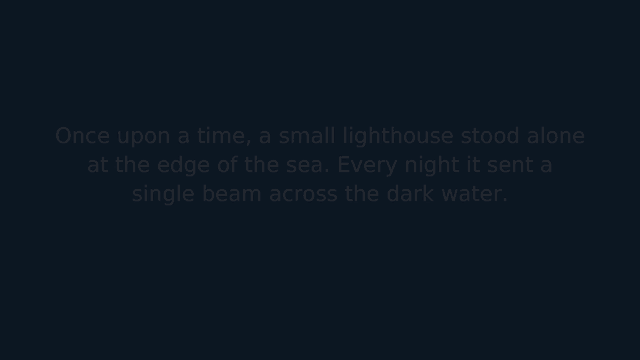

# story-builder
Based on provided story , generates animation video files

A local Spring Boot service that turns written text into a narrated, scrolling-text `.mp4`
(1920x1080, 24 fps, H.264 + AAC). The four-stage design — breakdown, assets, timeline/motion,
rendering — is described in [docs/PIPELINE.md](docs/PIPELINE.md).

## Example: story in, animation out

**The story** ([docs/media/demo-request.json](docs/media/demo-request.json)):

> Once upon a time, a small lighthouse stood alone at the edge of the sea. Every night it sent a
> single beam across the dark water.
>
> One stormy evening, a fishing boat lost its way among the rocks. The keeper turned the lamp as
> bright as it would go.
>
> The boat followed the light home, and the lighthouse was never lonely again.

**The request**, sent to the Docker image with default options:
```bash
curl -X POST localhost:8080/api/v1/stories \
  -H 'Content-Type: application/json' \
  -d @docs/media/demo-request.json
```

**The generated animation.** It's 25 s long and each paragraph becomes a scene that fades in, drifts
upward at 15 px/s, and fades out:



▶️ **[Watch the full video with narration (MP4, 1920x1080, 24 fps, 860 KB)](docs/media/lighthouse-story.mp4).**
The GIF above is a silent 640 px preview. The MP4 is the exact service output, narrated by the
Piper `en_US-lessac-medium` voice.

How the story was split into scenes (`GET /api/v1/jobs/{id}`):

| Scene | Text | Words | On screen |
|---|---|---|---|
| 0 | Once upon a time, a small lighthouse stood alone… | 26 | 10.42 s |
| 1 | One stormy evening, a fishing boat lost its way… | 23 | 9.21 s |
| 2 | The boat followed the light home… | 13 | 5.54 s |

## Run with Docker (Linux amd64 / arm64)
The image bundles Java 21, FFmpeg, Piper (natural neural voice, default) and espeak-ng (light fallback).
```bash
docker compose up -d --build
```
Or without compose:
```bash
docker build -t story-builder .
docker run -d -p 8080:8080 -v story-videos:/data/work story-builder
```
- Use the fallback voice: `-e STORYBUILDER_TTS_ENGINE=espeak`
- Bake in more Piper voices: `docker build --build-arg PIPER_VOICES="en_US-lessac-medium en_GB-alan-medium" .`, then pass `"voice": "en_GB-alan-medium"` per request
- Build for both architectures and push: `docker buildx build --platform linux/amd64,linux/arm64 -t <registry>/story-builder:0.1 --push .`
- Any `storybuilder.*` setting can be set as an env var, e.g. `STORYBUILDER_MAX_CONCURRENT_JOBS=4`

## Run locally
Prerequisites: JDK 21 and FFmpeg with libx264. The voice engine is picked automatically
(`storybuilder.tts.engine=auto`): macOS `say` → Piper → espeak-ng.

**macOS**
```bash
brew install ffmpeg
./gradlew bootRun
```

**Linux (no Docker)**, e.g. Ubuntu/Debian:
```bash
sudo apt-get install -y openjdk-21-jre-headless ffmpeg espeak-ng fonts-dejavu-core python3-venv
# Optional, for the natural voice:
python3 -m venv ~/piper && ~/piper/bin/pip install piper-tts==1.8.0
~/piper/bin/python -m piper.download_voices --data-dir ~/piper/voices en_US-lessac-medium

./gradlew bootJar
STORYBUILDER_TTS_PIPER_BINARY=~/piper/bin/piper STORYBUILDER_TTS_PIPER_DATA_DIR=~/piper/voices \
  java -jar build/libs/app.jar
```
Without Piper installed, `auto` falls back to espeak-ng.

## Use
```bash
curl -i -X POST localhost:8080/api/v1/stories \
  -H 'Content-Type: application/json' \
  -d '{"text":"Once upon a time, a lighthouse stood alone.\n\nOne night a boat found its way home."}'
```
The response is `202 Accepted` with a `jobId`. Poll the status, then download the video:
```bash
curl localhost:8080/api/v1/jobs/<jobId>
curl -o story.mp4 localhost:8080/api/v1/jobs/<jobId>/video
```

| Method | Path | Result |
|---|---|---|
| `POST` | `/api/v1/stories` | `202` + `{ jobId, status, statusUrl, videoUrl }` |
| `GET` | `/api/v1/jobs/{id}` | `status` (`QUEUED → BREAKDOWN → ASSETS → LAYOUT → RENDERING → DONE / FAILED`), `progress`, `scenes`, `durationSeconds`, `error` |
| `GET` | `/api/v1/jobs/{id}/video` | `video/mp4` when done, `409` while rendering, `404` if unknown |

Optional `options` in the POST body (defaults in `application.yml`):

```json
{
  "text": "...",
  "options": {
    "width": 1920, "height": 1080, "fps": 24,
    "startY": 500, "scrollSpeed": 15,
    "wordsPerMinute": 150, "voice": "Samantha",
    "backgroundColor": "#101826", "textColor": "#F5F1E6", "fontSize": 64
  }
}
```
`voice` depends on the engine: a `say -v '?'` name on macOS, a Piper model name
(`en_US-lessac-medium`), or an espeak-ng voice (`en-gb`). Errors are returned as `application/problem+json`.

## Test
```bash
./gradlew build
```
Runs ktlint, the unit tests, and an end-to-end HTTP test that renders a real video (skipped when
ffmpeg is not installed).

**Against a running deployment** (Docker, a Linux server, or `bootRun`). This needs ffmpeg on the
machine running the tests, because it inspects the returned videos:
```bash
docker compose up -d --build
./gradlew e2eTest -Pe2e.baseUrl=http://localhost:8080
```
It checks:
- The mp4 format (h264, 1920x1080, 24 fps, AAC).
- That the narration is audible.
- That text is drawn and scrolls exactly 15 px/s.
- Custom options, seeking with byte ranges, and job queueing.
- The 400, 404 and 409 errors.
